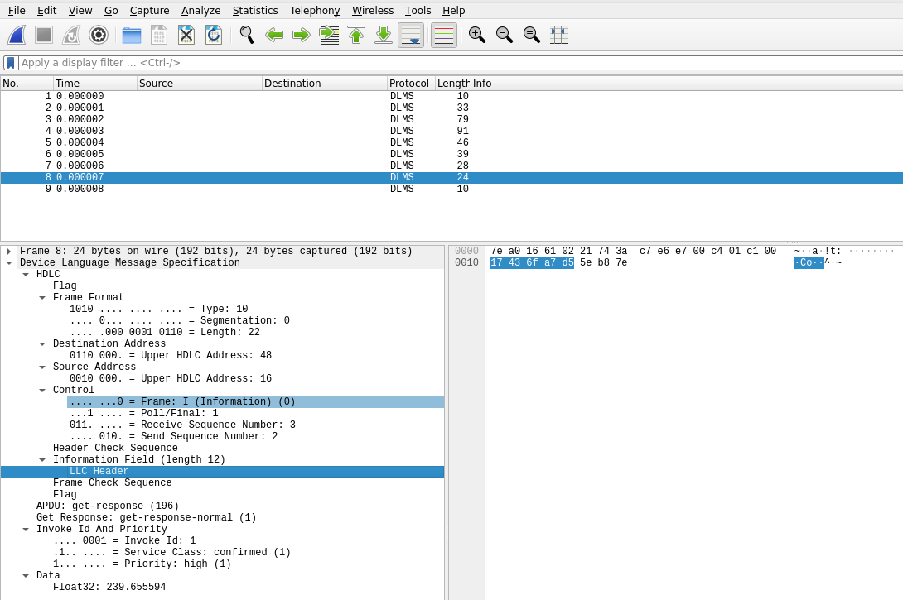
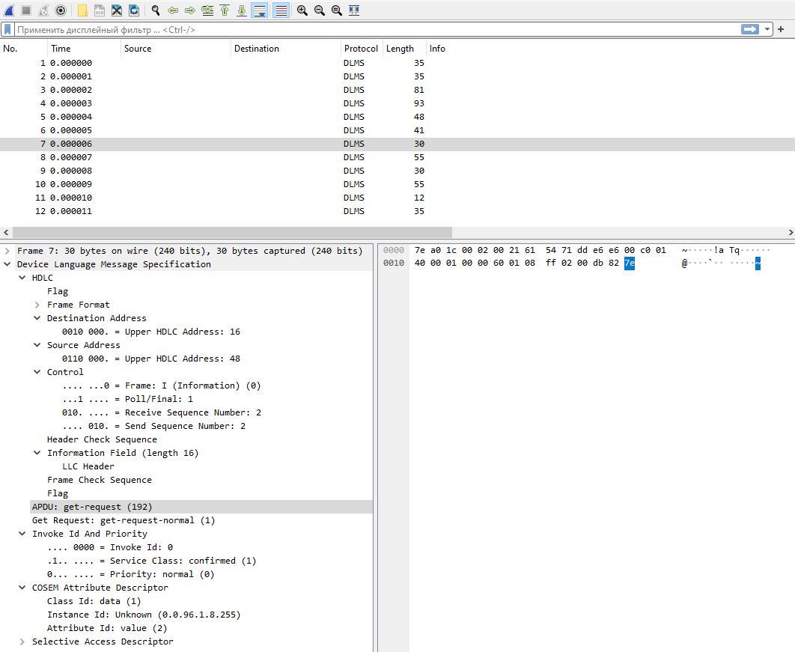

# wireshark-dlms

Device Language Message Specification (DLMS) dissector plugin for Wireshark.
Dissects DLMS APDUs in HDLC frames, IEC 61334-4-32 frames, wrapper frames, or raw data.

Common uses:
- Dissect DLMS protocol in UDP packets with destination port 4059 (the IANA assigned DLMS port), either captured live or imported from a pcap file or hex dump
- Dissect DLMS protocol sent to the external capture program udpdump, listening on any port, with payload type set to DLMS (see https://github.com/andrebdo/wireshark-udpdump for a pre-compiled version of udpdump that works in Windows)
- Dissect DLMS protocol handed off by custom dissectors
- Dissect DLMS protocol handed off by DLT_USER0 line port (non-network data)

## Install

### GNU/Linux

1. Compile the Wireshark source code for Unix, as described in https://www.wireshark.org/docs/wsdg_html_chunked/ChapterSetup.html#ChSetupUNIX
2. Copy content of scr directory to wireshark sources (wireshark-sources/plugins/epan/dlms)
4. Add plugin with CMakeListsCustom.txt (see CMakeListsCustom.txt.example) then recompile the Wireshark
3. Copy the dlms.so plugin to the Wireshark plugins directory: `sudo cp dlms.so /usr/local/lib/wireshark/plugins/4.2/epan/dlms.so`. To be sure about destination dir check wireshark plugins dir by Help->About Wireshark->Plugins.

### Windows

Copy the pre-compiled dlms.dll plugin file to your Wireshark plugins directory (usually C:\Program Files\Wireshark\plugins\4.1\epan\dlms.dll).

To compile the dlms.dll plugin yourself:
1. Compile the Wireshark source code for Windows, as described in https://www.wireshark.org/docs/wsdg_html_chunked/ChSetupWindows.html
2. Edit the build.bat file and adjust the directory paths as necessary
3. Copy content of scr directory to wireshark sources (wireshark\plugins\epan\dlms)
4. Run build.bat

**Notes:**
*Step 2 works out of box to compile wireshark if you already have installed all tools desribed in link from step 1 and wireshark sources are in adjacent folder with folder where build.bat placed*

## License

These files are distributed under the same license as Wireshark (the GNU General Public License version 2).
